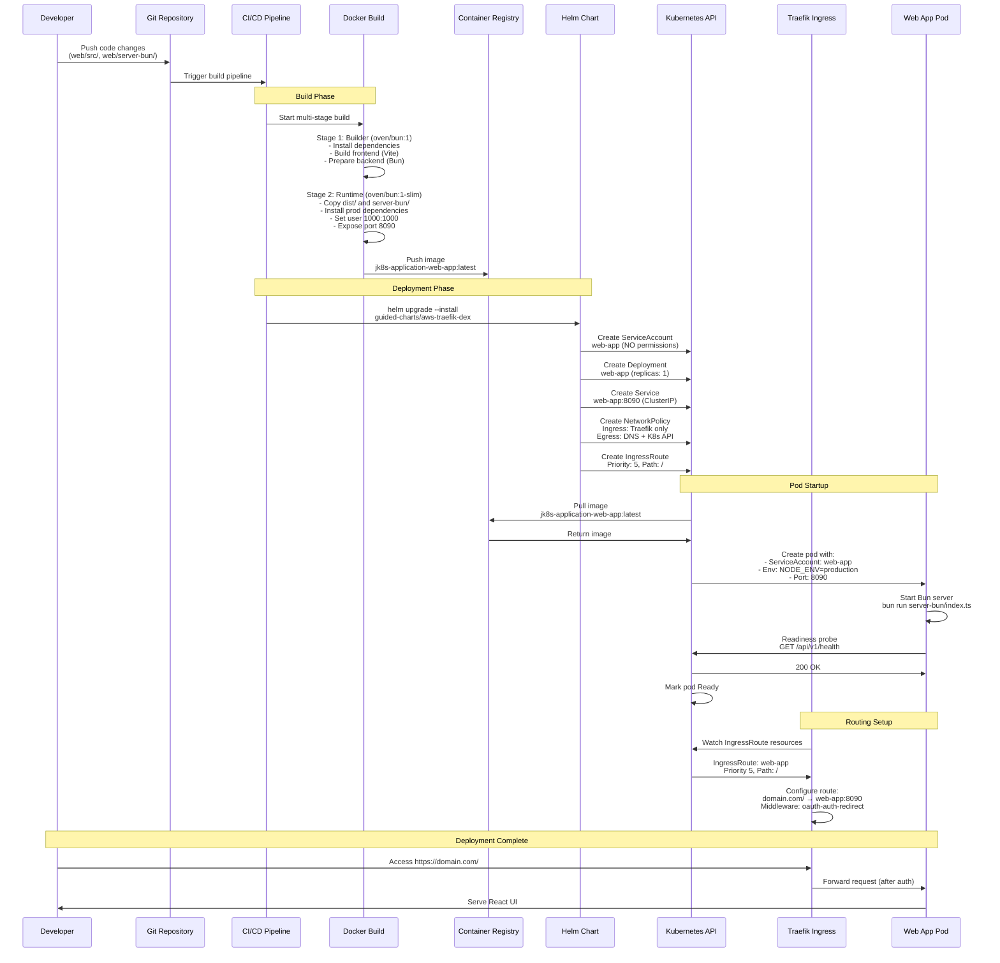
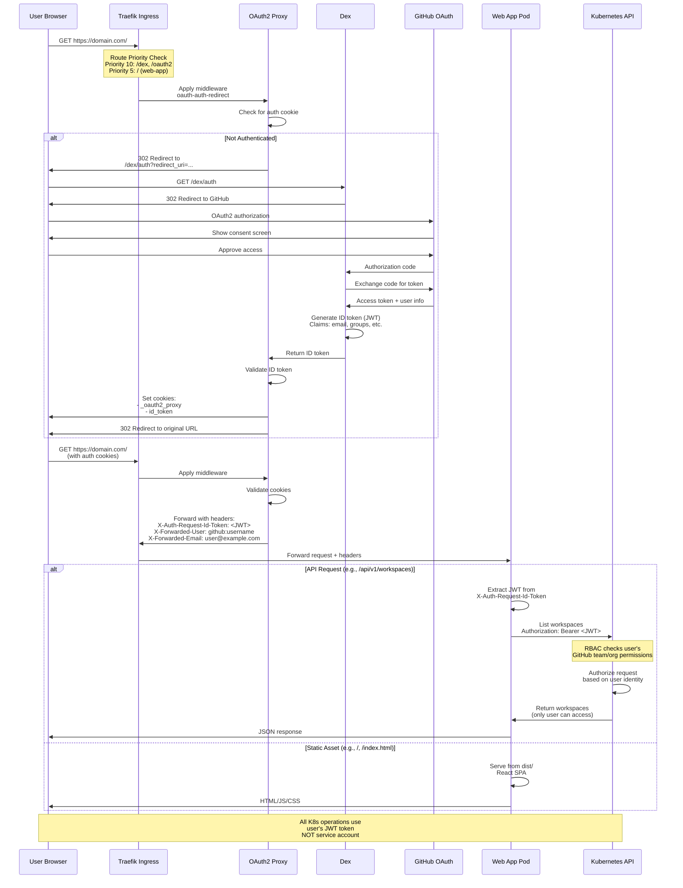

# UI Deployment Flow to Kubernetes Cluster

This document provides comprehensive sequence diagrams showing how the web UI is built, containerized, deployed to the Kubernetes cluster, and how authentication works.

## 1. Deployment Sequence Diagram



## 2. Authentication Flow Sequence Diagram



## Key Configuration

### Helm Values (`values.yaml`)
```yaml
webApp:
  enabled: true
  replicas: 1
  image:
    repository: jk8s-application-web-app
    tag: latest
    pullPolicy: IfNotPresent
  namespace: default  # Where workspaces are managed
  resources:
    limits:
      cpu: 500m
      memory: 512Mi
    requests:
      cpu: 100m
      memory: 128Mi
```

### Kubernetes Resources

| Resource | Details |
|----------|---------|
| **ServiceAccount** | `web-app` - NO permissions (zero-trust) |
| **Deployment** | 1 replica, port 8090, non-root user (1000:1000) |
| **Service** | ClusterIP on port 8090 |
| **NetworkPolicy** | Ingress: Traefik only<br/>Egress: DNS + K8s API |
| **IngressRoute** | Priority 5, Path: `/`, Middleware: oauth-auth-redirect |

### Environment Variables
- `NODE_ENV=production`
- `PORT=8090`
- `NAMESPACE=default`
- `STATIC_DIR=./dist`

### Health Probes
- **Liveness**: `/api/v1/health` - 10s initial, 3s timeout
- **Readiness**: `/api/v1/health` - 5s initial, 3s timeout

## API Endpoints

| Endpoint | Method | Description | Auth |
|----------|--------|-------------|------|
| `/api/v1/health` | GET | Health check | None |
| `/api/v1/workspaces` | GET | List workspaces | User JWT |
| `/api/v1/workspaces` | POST | Create workspace | User JWT |
| `/api/v1/workspaces/:name` | GET | Get workspace | User JWT |
| `/api/v1/workspaces/:name` | DELETE | Delete workspace | User JWT |
| `/api/v1/templates` | GET | List templates | User JWT |
| `/` | GET | React SPA | OAuth2 |

## Key Files

## Deployment Commands

```bash
# Build Docker image
cd images
make web-app

# Or manually
docker build -f images/web-app/Dockerfile -t jk8s-application-web-app:latest .

# Deploy with Helm
helm upgrade --install jupyter-k8s-router \
  ./guided-charts/aws-traefik-dex \
  --values custom-values.yaml \
  --namespace jupyter-k8s-router

# Verify deployment
kubectl get pods -n jupyter-k8s-router -l app=web-app
kubectl logs -n jupyter-k8s-router -l app=web-app
```

## Security Features

1. **Zero-Permission Service Account**:
   - Web app pod has NO Kubernetes permissions
   - All operations use user's OAuth token
   - No privilege escalation possible

2. **Multi-layer Authentication**:
   - OAuth2 Proxy validates session
   - Dex handles OAuth with GitHub
   - Kubernetes RBAC enforces per-user permissions

3. **Network Isolation**:
   - NetworkPolicy restricts ingress to Traefik only
   - Egress limited to DNS and K8s API
   - No access to other cluster services

4. **Container Security**:
   - Non-root user (1000:1000)
   - All capabilities dropped
   - Read-only root filesystem (where possible)

5. **TLS Encryption**:
   - All traffic encrypted via Traefik
   - Automatic certificate management

6. **Token-based Authorization**:
   - User's OAuth token forwarded to K8s API
   - RBAC enforced per-user, per-request
   - No shared credentials

## Troubleshooting

```bash
# Check pod status
kubectl get pods -n jupyter-k8s-router -l app=web-app

# View logs
kubectl logs -n jupyter-k8s-router -l app=web-app -f

# Check service
kubectl get svc -n jupyter-k8s-router web-app

# Check ingress route
kubectl get ingressroute -n jupyter-k8s-router web-app -o yaml

# Verify route priority
kubectl get ingressroute -n jupyter-k8s-router -o yaml | grep -A 5 priority

# Test health endpoint (from within cluster)
kubectl run -it --rm debug --image=curlimages/curl --restart=Never -- \
  curl http://web-app.jupyter-k8s-router:8090/api/v1/health

# Check network policy
kubectl get networkpolicy -n jupyter-k8s-router web-app -o yaml

# Verify service account has no permissions (should fail)
kubectl auth can-i list workspaces \
  --as=system:serviceaccount:jupyter-k8s-router:web-app \
  -n default
# Expected: no
```
