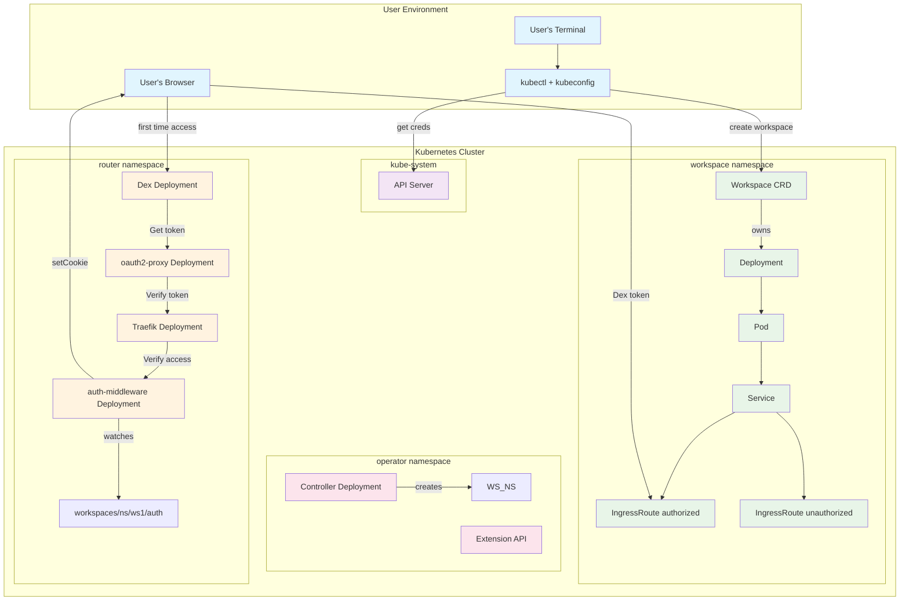

# UI Integration Architecture Diagrams

## P0: Current Architecture (Without UI)



## P1: Proposed Architecture (With Optional UI)

```
Jupyter-k8s
OIDC flow + UI
                    ┌─────────────────────────────────────────────────────────────────────────────────────┐
                    │                           Kubernetes Cluster                                        │
┌─────────────────┐ │                                                                                     │
│   User's        │ │  ┌─────────────────┐    ┌─────────────────────────────────────────────────────┐   │
│   terminal      │ │  │   kube-system   │    │              operator namespace                     │   │
│                 │ │  │                 │    │                                                     │   │
│ ┌─────────────┐ │ │  │  ┌───────────┐  │    │  ┌─────────────┐    ┌─────────────────────────┐   │   │
│ │   kubectl   │ │ │  │  │API server │  │    │  │ controller  │    │      extension          │   │   │
│ │             │ │ │  │  │           │  │    │  │ deployment  │    │      api                │   │   │
│ │   kube      │ │ │  │  └───────────┘  │    │  │             │    │                         │   │   │
│ │   config    │ │ │  └─────────────────┘    │  │ ┌─────────┐ │    │  ┌─────────────────┐   │   │
│ └─────────────┘ │ │           │              │  │ │controller│ │    │  │                 │   │   │
└─────────────────┘ │           │              │  │ └─────────┘ │    │  └─────────────────┘   │   │
         │           │           │              │  └─────────────┘    └─────────────────────────┘   │
         │ get       │           │              │           │                        │               │
         │ creds     │           │              │           │ create                 │               │
         ▼           │           │              │           ▼                        │               │
┌─────────────────┐ │           │              │  ┌─────────────────────────────────────────────┐   │
│      STEP 1     │ │           │              │  │            workspace namespace              │   │
└─────────────────┘ │           │              │  │                                             │   │
         │           │           │              │  │  ┌─────────────────────────────────────┐   │   │
         │ create    │           │              │  │  │             Workspace               │   │   │
         │ workspace │           │              │  │  │                                     │   │   │
         ▼           │           │              │  │  │  ┌─────────────┐                   │   │   │
┌─────────────────┐ │           │              │  │  │  │ deployment  │                   │   │   │
│      STEP 2     │ │           │              │  │  │  │             │ owns              │   │   │
└─────────────────┘ │           │              │  │  │  └─────────────┘                   │   │   │
         │           │           │              │  │  │         │                          │   │   │
         │           │           │              │  │  │         ▼                          │   │   │
         │ first     │           │              │  │  │  ┌─────────────┐                   │   │   │
         │ time      │           │              │  │  │  │    Pod      │                   │   │   │
         │ access    │           │              │  │  │  │             │                   │   │   │
         ▼           │           │              │  │  │  └─────────────┘                   │   │   │
┌─────────────────┐ │           │              │  │  └─────────────────────────────────────┘   │   │
│      STEP 3     │ │           │              │  │                                             │   │
└─────────────────┘ │           │              │  │  ┌─────────────┐    ┌─────────────────┐   │   │
         │           │           │              │  │  │   Service   │    │  IngressRoute   │   │   │
         │           │           │              │  │  │             │    │  authorized     │   │   │
         ▼           │           │              │  │  └─────────────┘    └─────────────────┘   │   │
┌─────────────────┐ │           │              │  │         │                     │            │   │
│      STEP 4     │ │           │              │  │         │                     │            │   │
└─────────────────┘ │           │              │  │         ▼                     ▼            │   │
         │           │           │              │  │  ┌─────────────────────────────────────┐   │   │
         │           │           │              │  │  │         IngressRoute                │   │   │
         ▼           │           │              │  │  │         unauthorized                │   │   │
┌─────────────────┐ │           │              │  │  └─────────────────────────────────────┘   │   │
│   User's        │ │           │              │  └─────────────────────────────────────────────┘   │
│   webbrowser    │ │           │              └─────────────────────────────────────────────────────┘
│                 │ │           │
│ ┌─────────────┐ │ │           │
│ │   jupyter   │ │ │           │
│ └─────────────┘ │ │           │
└─────────────────┘ │           │
         ▲           │           │
         │           │  ┌─────────────────┐
         │           │  │   router        │
         │           │  │   namespace     │
         │           │  │                 │
         │           │  │  ┌───────────┐  │
         │           │  │  │    dex    │  │
         │           │  │  │deployment │  │ Get
         │           │  │  │           │  │ token
         │           │  │  └───────────┘  │
         │           │  │        │        │
         │           │  │        │        │
         │           │  │  ┌───────────┐  │
         │           │  │  │oauth2-proxy│ │
         │           │  │  │deployment │  │ Verify
         │           │  │  │           │  │ token
         │           │  │  └───────────┘  │
         │           │  │        │        │
         │           │  │        │        │
         │           │  │  ┌───────────┐  │ ◄─── NEW: OPTIONAL UI BACKEND
         │           │  │  │UI Backend │  │      • React SPA serving
         │           │  │  │deployment │  │      • REST API (/api/v1/*)
         │           │  │  │           │  │      • SSE events
         │           │  │  │ ┌───────┐ │  │      • Workspace CRUD
         │           │  │  │ │React  │ │  │      • Template selection
         │           │  │  │ │ SPA   │ │  │
         │           │  │  │ └───────┘ │  │
         │           │  │  └───────────┘  │
         │           │  │        │        │
         │           │  │        │ OR     │
         │           │  │        ▼        │
         │           │  │  ┌───────────┐  │
         │           │  │  │  traefik  │  │ Verify
         │           │  │  │deployment │  │ access
         │           │  │  │           │  │
         │           │  │  └───────────┘  │
         │           │  │        │        │
         │           │  │        │        │
         │           │  │  ┌───────────┐  │
         │           │  │  │   auth-   │  │
         │           │  │  │middleware │  │
         │           │  │  │deployment │  │
         │           │  │  │           │  │
         │           │  │  └───────────┘  │
         │           │  │        │        │
         │           │  │        │ watches│
         │           │  │        ▼        │
         │           │  │ workspaces/ns   │
         │           │  │ /ws1/auth       │
         │           │  │                 │
         │           │  │  setCookie      │
         │           │  └─────────────────┘
         │                      │
         │                      │ Dex
         │                      │ token
         │                      ▼
         └──────────────────────────────────────

┌─────────────────┐ ◄─── NEW: WEB UI ACCESS PATH
│   NEW: Web UI   │      (OPTIONAL - can be disabled)
│   User Access   │
│                 │      ┌─────────────────────────────────┐
│ ┌─────────────┐ │      │         UI Features             │
│ │   Browser   │ │      │  • Self-service workspace      │
│ │   React UI  │ │      │    creation & management       │
│ └─────────────┘ │      │  • Template-based setup        │
└─────────────────┘      │  • Real-time status updates    │
         │                │  • Resource monitoring         │
         │ HTTPS          │  • Access control UI           │
         ▼                └─────────────────────────────────┘
┌─────────────────┐
│   UI Backend    │ ◄─── Routes to Extension API for
│   Service       │      permission checks & auth
│   • REST API    │
│   • Static SPA  │
│   • SSE Events  │
└─────────────────┘
```

## Key Changes in P1:

1. **Optional UI Backend**: Added in router namespace, can be enabled/disabled
2. **Routing Logic**: oauth2-proxy routes based on UI enabled/disabled state
3. **New Access Path**: Web UI provides self-service workspace management
4. **Backward Compatible**: All existing kubectl/API flows unchanged
5. **Same Security Model**: UI Backend delegates auth to Extension API
## P1: Proposed Architecture (With Optional UI)

```mermaid
graph TB
    subgraph "User Environment"
        UT[User's Terminal]
        UB[User's Browser]
        WUI[Web UI User]
        UT --> KC[kubectl + kubeconfig]
        WUI --> |HTTPS| WEB_UI[React SPA]
    end

    subgraph "Kubernetes Cluster"
        subgraph "kube-system"
            API[API Server]
        end
        
        subgraph "operator namespace"
            CTRL[Controller Deployment]
            EXT[Extension API]
            CTRL --> |creates| WS_NS
        end
        
        subgraph "workspace namespace"
            WS[Workspace CRD]
            DEP[Deployment]
            POD[Pod]
            SVC[Service]
            IR_AUTH[IngressRoute authorized]
            IR_UNAUTH[IngressRoute unauthorized]
            
            WS --> |owns| DEP
            DEP --> POD
            POD --> SVC
            SVC --> IR_AUTH
            SVC --> IR_UNAUTH
        end
        
        subgraph "router namespace"
            DEX[Dex Deployment]
            OAUTH[oauth2-proxy Deployment]
            UI_BACKEND[UI Backend Deployment<br/>🆕 OPTIONAL]
            TRAEFIK[Traefik Deployment]
            AUTH_MW[auth-middleware Deployment]
            
            DEX --> |Get token| OAUTH
            OAUTH --> |Route Decision| UI_BACKEND
            OAUTH --> |OR (if UI disabled)| TRAEFIK
            UI_BACKEND --> |Serves React SPA| WEB_UI
            UI_BACKEND --> |REST API /api/v1/*| API_CALLS[Workspace CRUD]
            UI_BACKEND --> |Permission checks| EXT
            TRAEFIK --> |Verify access| AUTH_MW
            AUTH_MW --> |watches| WS_PATH[workspaces/ns/ws1/auth]
            AUTH_MW --> |setCookie| UB
        end
    end

    %% User flows
    KC --> |get creds| API
    KC --> |create workspace| WS
    UB --> |first time access| DEX
    UB --> |Dex token| IR_AUTH
    
    %% New UI flows
    WEB_UI --> |User auth headers| UI_BACKEND
    API_CALLS --> |K8s service account| WS
    
    %% UI Backend features
    subgraph "UI Features"
        FEAT1[Self-service workspace creation]
        FEAT2[Template-based setup]
        FEAT3[Real-time status updates]
        FEAT4[Resource monitoring]
        FEAT5[Access control UI]
    end
    
    UI_BACKEND -.-> FEAT1
    UI_BACKEND -.-> FEAT2
    UI_BACKEND -.-> FEAT3
    UI_BACKEND -.-> FEAT4
    UI_BACKEND -.-> FEAT5

    %% Styling
    classDef userEnv fill:#e1f5fe
    classDef k8sNs fill:#f3e5f5
    classDef routerNs fill:#fff3e0
    classDef workspaceNs fill:#e8f5e8
    classDef operatorNs fill:#fce4ec
    classDef newComponent fill:#ffebee,stroke:#d32f2f,stroke-width:2px
    classDef uiFeatures fill:#f1f8e9,stroke:#689f38,stroke-dasharray: 5 5

    class UT,UB,KC,WUI,WEB_UI userEnv
    class API k8sNs
    class DEX,OAUTH,TRAEFIK,AUTH_MW routerNs
    class UI_BACKEND newComponent
    class WS,DEP,POD,SVC,IR_AUTH,IR_UNAUTH workspaceNs
    class CTRL,EXT operatorNs
    class FEAT1,FEAT2,FEAT3,FEAT4,FEAT5 uiFeatures
```

## Key Changes in P1:

### 🆕 New Components:
- **UI Backend Deployment**: Optional component in router namespace
- **Web UI Access Path**: Browser-based workspace management
- **Route Decision Logic**: oauth2-proxy routes based on UI enabled/disabled

### 🔄 Modified Flows:
- **When UI Enabled**: oauth2-proxy → UI Backend → Extension API
- **When UI Disabled**: oauth2-proxy → Traefik → Extension API (unchanged)

### 🛡️ Security Model:
- **User Authentication**: Headers from oauth2-proxy (`X-Auth-Request-*`)
- **Service Account**: UI Backend uses K8s service account for API calls
- **Permission Delegation**: Extension API validates user permissions
- **No Privilege Escalation**: Same authorization checks as direct API access

### ⚙️ Deployment Options:
```yaml
# Helm values.yaml
uibackend:
  enabled: false  # Default: backward compatible
  replicas: 1
  image:
    repository: uibackend
    tag: latest
  namespace: default  # Where workspaces are created
```

## Credential Requirements Summary:

### UI Backend Service Account Needs:
```yaml
rules:
# Workspace CRUD operations
- apiGroups: ["workspace.jupyter.org"]
  resources: ["workspaces", "workspacetemplates"]
  verbs: ["get", "list", "watch", "create", "update", "patch", "delete"]
# Permission checks via Extension API
- apiGroups: ["connection.jupyter.org"] 
  resources: ["workspaceaccessreviews"]
  verbs: ["create"]
```

### User Authentication Flow:
1. **oauth2-proxy** validates user via Dex (OIDC)
2. **Headers set**: `X-Auth-Request-User`, `X-Auth-Request-Groups`, `X-Auth-Request-Email`
3. **UI Backend** reads headers, uses service account for K8s API calls
4. **Extension API** validates user permissions via SubjectAccessReview
5. **Same security model** as direct kubectl/API access